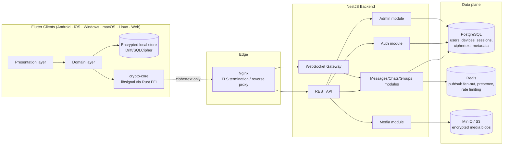

# Skyline — Architecture Overview

Skyline is a privacy-first, cross-platform messaging platform for a private, invite-only community. The server is deliberately kept "dumb": it authenticates devices, stores and relays ciphertext, and fans out real-time events. It never has access to plaintext message content or to any private key material — all encryption and decryption happens on-device.

## Component diagram

## Core principle: server never sees plaintext

- Every message body, media file, and call payload is encrypted client-side using Signal Protocol primitives (X3DH key agreement + Double Ratchet session keys) before it ever leaves the device.
- The backend's job is limited to: identity/device verification, ciphertext storage and delivery, presence/typing/read-receipt *metadata* (not content), invite and role management, rate limiting, and abuse detection on traffic patterns — never content inspection.
- Private keys (identity keys, session keys) are generated and stored exclusively on-device (secure enclave / keystore where available); they are never transmitted to or held by the server.

## Request flow (message send, simplified)

1. Client encrypts the message locally using the recipient's current Double Ratchet session (established via X3DH on first contact).
2. Client sends the ciphertext + minimal routing metadata (sender device ID, recipient ID, timestamp, message ID) to the backend over the authenticated REST/WebSocket channel (TLS via Nginx).
3. Backend persists the ciphertext blob and metadata in PostgreSQL, publishes a delivery event on Redis pub/sub.
4. Backend fans the event out over WebSocket to the recipient's connected devices (or queues for offline push/pull delivery).
5. Recipient device decrypts locally using its Double Ratchet session state; the server never held a decryptable copy.

## Real-time transport

WebSocket (native `ws`, via `@nestjs/platform-ws`) rather than Socket.IO: Skyline's clients are all first-party Flutter builds, so we don't need Socket.IO's browser-fallback transports (long-polling, etc.) — a lighter native WebSocket gateway reduces overhead and attack surface. Redis pub/sub is used to fan out events across backend instances once the deployment scales beyond a single process.

## Deferred to later phases

- Concrete PostgreSQL schema — Phase 3.
- Auth flows (invite codes, passkeys, biometrics, recovery codes) — Phase 4.
- libsignal-client integration details and the Web/WASM risk — Phase 5 (see `known-risks.md`).
- WebRTC calling architecture — Phase 8.
- Production deployment topology (TLS certs, secrets, backups, CI/CD) — Phase 11.
